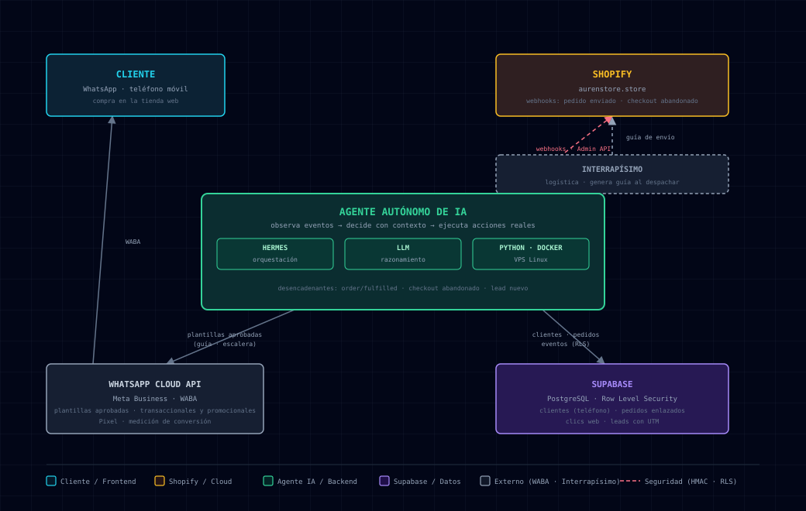

# AUREN · Agente de Ventas Autónomo con IA

> **Case study de un ecosistema e-commerce diseñado e implementado de punta a punta** — storefront, modelo de datos y un agente de IA autónomo que observa, decide y ejecuta.

**AUREN** ([aurenstore.store](https://aurenstore.store)) es una tienda de calzado en Colombia construida sobre Shopify. **El autor diseñó e implementó la plataforma completa**: el tema de la tienda a medida, la base de datos (Supabase con Row Level Security: clientes, pedidos, clics y leads con UTM) y el agente de IA autónomo que automatiza la operación comercial y de posventa por WhatsApp.

---

## 📖 English Summary

> **A complete e-commerce ecosystem designed and built end-to-end by the author** — storefront, data model, and an autonomous AI agent running the real store's sales and post-sales over WhatsApp Business.

- 🛒 **Store:** [AUREN](https://aurenstore.store) — a footwear e-commerce in Colombia. Custom Shopify theme designed by the author.
- 🗄️ **Data model:** Supabase (PostgreSQL + Row Level Security) designed by the author — customers, orders, clicks, UTM-attributed leads.
- 🤖 **What the agent does:** notifies customers of shipping guides the moment an order is fulfilled · recovers abandoned checkouts with a 3-touch discount ladder (CTA opens checkout with the coupon pre-applied) · captures leads with UTM attribution.
- 📱 **Meta Business:** WhatsApp Business Platform (WABA) with Meta-approved templates (transactional + promotional) and Meta Pixel conversion tracking.
- 🧱 **Stack:** Shopify (custom theme + Admin API) · Supabase · Python · Docker · autonomous agent orchestration (Hermes) · LLM reasoning · Interrapísimo shipping.
- 🔒 **Privacy by design:** this repo is public narrative only — no production code, credentials, routes, or customer data. The live system stays private.

_El caso completo continúa en español a continuación._

## 🤖 ¿Por qué un *agente* y no un chatbot?

| | Chatbot clásico | Agente autónomo |
|---|---|---|
| **Entrada** | El cliente inicia y pregunta | La tienda misma genera eventos (webhooks) |
| **Acción** | Responde texto | Ejecuta: consulta APIs, envía mensajes, aplica descuentos |
| **Contexto** | Conversación | Estado real del negocio: pedidos, stock, historial |
| **Horario** | Limitado al humano | 24/7 sin intervención |

El agente no espera a que le pregunten: **cuando un pedido pasa a enviado, el cliente ya recibió su guía por WhatsApp** — sin que nadie lo escriba.

---

## 🎯 El problema

- Seguimiento de pedidos y notificación de guías 100% manual.
- Carritos abandonados (>70% en e-commerce) sin ningún mecanismo de recuperación.
- Atención al cliente limitada a horario comercial.
- Cero trazabilidad del ciclo *clic → lead → pedido → entrega*.

## ⚙️ La solución: arquitectura

  

**Evento → Acción del agente:**

| Evento de la tienda | Acción autónoma del agente |
|---|---|
| Pedido marcado como enviado (con guía Interrapísimo) | WhatsApp transaccional al cliente: confirmación + número de guía, sin intervención humana |
| Checkout abandonado | **Escalera de recuperación**: recordatorio → descuento progresivo (toque 2 y 3) con CTA que abre el checkout con el cupón ya aplicado |
| Lead nuevo (formulario flotante con UTM) | Registro en Supabase con atribución de origen (campaña/medio) |
| Consulta de disponibilidad | Respuesta con stock real vía API, no catálogo estático |

---

## 📱 Meta Business en el centro de la operación

- **WhatsApp Business Platform (WABA)** con plantillas aprobadas por Meta: mensajes *transaccionales* (guías, confirmaciones) y *promocionales* (escalera de descuentos) — siempre con plantillas aprobadas, cumpliendo las políticas de calidad de Meta.
- **Pixel de Meta** para medición de conversión del tráfico pagado y orgánico.
- **Embudo medible**: cada lead queda etiquetado con su origen UTM para saber qué campaña realmente vende.

## 🧱 Componentes clave

| Componente | Rol |
|---|---|
| **Tema Shopify a medida** | Storefront de la tienda diseñado por el autor (Liquid) |
| **Supabase (PostgreSQL + RLS)** | Modelo de datos diseñado por el autor: clientes, pedidos, eventos, clics con UTM — acceso por fila |
| **Agente Hermes** (Nous Research) | Orquestación autónoma del agente en bucle |
| **LLM** | Razonamiento con contexto de negocio |
| **Shopify Admin API** | Lectura/escritura de pedidos y stock |
| **Python + Docker** | Servicio del agente en VPS Linux |
| **WhatsApp Cloud API** | Canal de comunicación (WABA) |
| **Interrapísimo** | Logística de envíos (guías) |

> **Alcance del autor:** el proyecto no es solo el agente — incluye el diseño del storefront (tema Liquid a medida), el esquema completo de base de datos (Supabase con RLS y políticas por fila), la lógica de captura de leads con atribución UTM y la integración Meta Business, todo implementado y operado en producción.

## 🔒 Blindaje de datos

Este repositorio es **narrativa pública**: no contiene código de producción, credenciales, rutas internas ni datos de clientes. Los datos reales (teléfonos, pedidos) viven únicamente en Supabase con Row Level Security; el sistema operativo permanece en un repositorio privado. La privacidad del cliente final es parte del diseño, no un añadido.

## 📈 Resultados

> Sección reservada para métricas agregadas reales de operación (por confirmar con el autor).

---

## 👤 Autor

**Johan Sarria** — Data Science & IA · Automatización de negocios con agentes

[GitHub](https://github.com/Johansarria) · [LinkedIn](https://www.linkedin.com/in/johansarria/)
